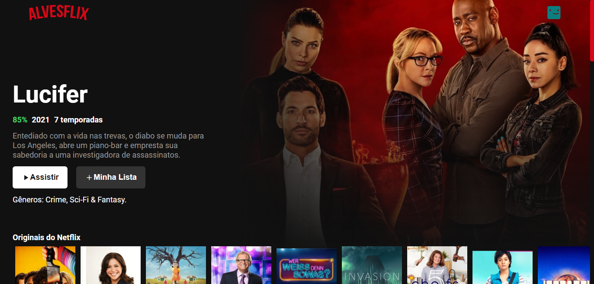

<h1 align="center">
  
</h1>

<p align="center">
     
</p>

<p align="center">
  <a href="#-technologias">Tecnologias</a>&nbsp;&nbsp;&nbsp;|&nbsp;&nbsp;&nbsp;
  <a href="#-projeto">Projeto</a>&nbsp;&nbsp;&nbsp;|&nbsp;&nbsp;&nbsp;
  <a href="#-como-usar?">Como usar?</a>&nbsp;&nbsp;|&nbsp;&nbsp;&nbsp;&nbsp;
  <a href="#-direitos">Direitos</a>&nbsp;&nbsp;&nbsp;&nbsp;&nbsp;&nbsp;
</p>

## 🚀 Tecnologias

Este projeto foi desenvolvido com as seguintes tecnologias:

- <a href="https://pt-br.reactjs.org/">React</a>
- <a href="https://developer.mozilla.org/pt-BR/docs/Web/HTML">HTML</a>
- <a href="https://developer.mozilla.org/pt-BR/docs/Web/CSS">CSS</a>
- <a href="https://yarnpkg.com/">Yarn</a>

## 💻 Projeto

Alvesflix é um UI Clone inspirado no serviço de streaming da Netflix. Para seu desenvolvimento foi utilizado como base de dados a API The Movie Database.

Features:
- Filme destaque
- Filmes originais netflix
- Setas de rolagem para cada lista
- Filmes divididos em categorias: romance, ação, aventura, etc.

## ⌨ Como usar?

Em primeiro lugar, clone o repositório:

```bash
# Clonando o repositório
git clone https://github.com/hitaloalvess/alvesflix.git

# ✅ Em sequência:

# Instale as dependências:
yarn install

# Inicie o projeto no modo desenvolvedor
yarn start
```

## :memo: Direitos

Todos direitos são reservados a Netflix e ao The Movie Database.

---
Made with ♥ by Hitalo 🚀
